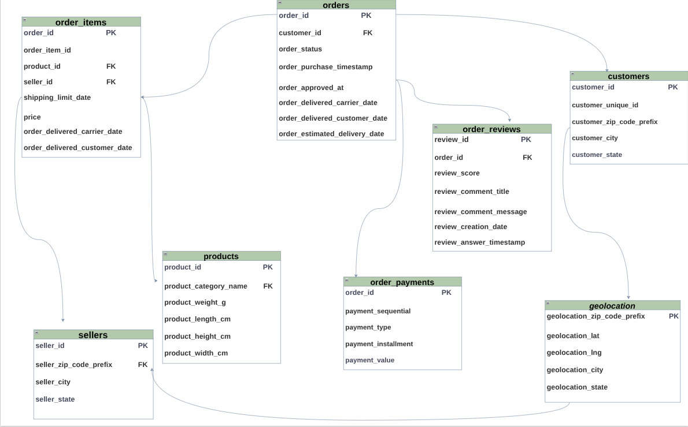

# **Olist E-Commerce Analysis: Sales, Delivery & Customer Satisfaction (2016–2018)**

---

## 📌 **Project Overview**

This project analyzes Olist's Brazilian e-commerce platform across sales, delivery operations, 
and customer satisfaction from September 2016 to August 2018.

The analysis uses Python and MySQL to query, explore, and visualize data, uncovering hidden 
trends across 95K+ orders — from revenue patterns and geographic distribution to delivery 
performance and customer behavior.

---

## **📊 Key Findings**

| Area | Finding |
|---|---|
| Revenue | Grew steadily over time and stabilized at ~R$1M/month in 2018 |
| Geography | São Paulo dominates with ~R$5M revenue and +40K orders |
| Delivery | Northern states (RR, AC, RO) pay ~R$43 avg shipping and wait the longest |
| Categories | Health & Beauty and Bed & Bath lead in both revenue and order volume |
| Satisfaction | Faster delivery = higher review score |
| Retention | 97% of customers never come back after the first purchase |
| Spenders | ~82% of customers are low spenders, only ~4% spend over R$500 |
| Payments | 75% of all transactions are made by credit card |
| Installments | Avg order value when paying in installments is higher than single payment |
| Seasonality | Distinct November spikes align with Black Friday/Cyber Monday, followed by a standard December "cool down." |

---

## 💡 **Recommendations**

| Area | Recommendation |
|---|---|
| Retention | Developing customer loyalty programs will positively impact revenue |
| Delivery | Partner with local carriers especially in northern states to reduce delivery time, which is directly linked to improving customer ratings |
| Sellers | Review and support sellers causing extreme delivery delays |
| Payments | Promote installment payment options more aggressively |
| Geography | Expand the seller network in northern and northeastern states to reduce distance and costs |
| Categories | Invest more in marketing for high-value categories (computers, electronics) and improve quality in Security & Services |

--

## 🗂️ **Dataset**

**Source:** [Brazilian E-Commerce Public Dataset by Olist](https://www.kaggle.com/datasets/olistbr/brazilian-ecommerce) — Kaggle

**About:** A public dataset covering orders placed on the Olist marketplace across multiple 
online channels in Brazil. It provides a 360° view of each order — including status, pricing, 
payment, shipping, customer location, product details, and reviews.

**Period:** Sep 2016 – Aug 2018

**Scale:** 95K+ orders · 93K+ customers · 3K+ sellers · 30K+ products

**Data Model:**


---

## 🛠️ **Tools & Technologies**

| Tool | Purpose |
|---|---|
| MySQL / MariaDB | Data storage and querying |
| JupySQL (`%%sql` magic) | Running SQL queries directly inside Jupyter notebooks |
| Python (Pandas, Matplotlib, Seaborn) | Data processing and visualization |
| Jupyter Notebook | Analysis environment |
| Looker Studio | Interactive dashboard |

---

### 🌐 Live Dashboard

[View Interactive Dashboard](https://lookerstudio.google.com/reporting/93290cfa-2ea8-4950-ba5e-4773ee00f9e5)

---

## 📁 Project Structure
```
    olist-analysis/
    │
    ├── data_preparation.ipynb        # data preparation and database connection
    ├── indices.ipynb                 # database performance SQL script
    ├── analysis.ipynb                # main analysis notebook
    ├── requirements.txt              # project dependencies
    ├── schema/
    │   └── schema.png                # database schema
    │
    ├── dashboard/
    │   ├── overview.png              # page 1 — KPIs, time series, geography
    │   ├── operations.png            # page 2 — delivery performance & satisfaction
    │   └── products_customers.png    # page 3 — categories, payments & customer segments
    │
    ├── data/
    │   └── master_orders.csv         # exported flat table for Looker Studio
    │
    └── README.md
```
---

## ⚡ Database Performance

Before running the analysis, `indices.ipynb` optimizes the database by adding primary keys and 
indices to all tables — reducing query execution time significantly.

---

## ▶️ How to Run

  1. Clone the repository
  ```bash
     git clone https://github.com/abdelhakmorhlia01-hub/olist-ecommerce-analysis.git
  ```
  2. Install dependencies
  ```bash
     pip install -r requirements.txt
  ```
  3. Create a `.env` file with your database credentials
  ```
     DB_NAME=your_db_name
     DB_USER=your_user
     DB_PASSWORD=your_password
     DB_HOST=localhost
     DB_PORT=3306
  ```
  4. Run `data_preparation.ipynb` first to set up the database
  5. Run `indices.ipynb` to optimize performance
  6. Run `analysis.ipynb` for the full analysis
  ```

---

## 👤 Author

Abdelhak Morhlia

## 📫 Contact Me
[](https://www.linkedin.com/in/abdelhak-morhlia-41366a396/)
_____________________________


